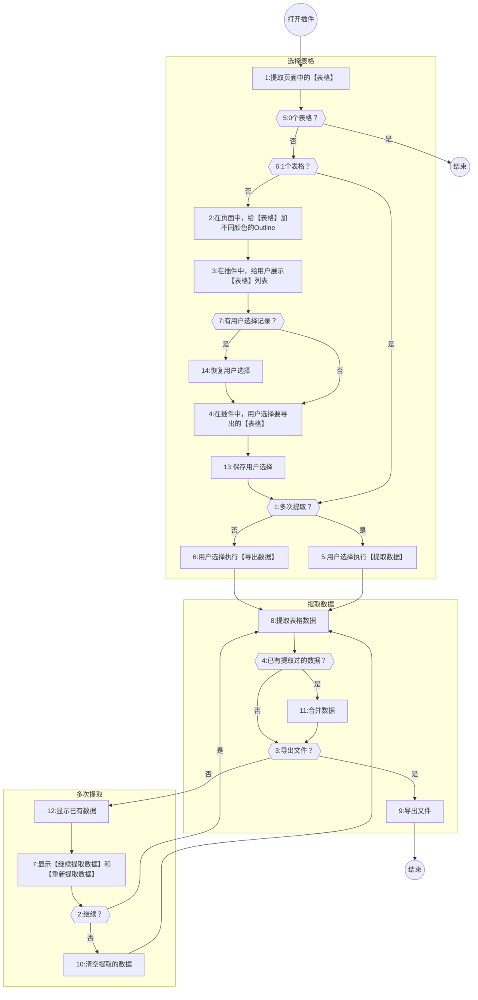

将页面中表格导出为`xlsx`文件的浏览器插件。

# 安装

```shell
git clone https://github.com/jasony62/table2xlsx.git
```

```shell
cd table2xlsx
pnpm i
pnpm build
```

打开`chrome`浏览器，在地址栏输入`chrome://extensions`。

打开右上角的**开发者模式**，点击左侧的**加载已解压的扩展程序**，选择`table2xlsx/dist`目录。

用`chrome`浏览器打开任意页面，点击**扩展程序**按钮打开插件。

# 使用指南



## 情景 1：页面中只有一个表格，不需要合并多页

直接点击【导出数据】导出表格数据。

如果页面只有 1 个表格，应用会自动将这个表格作为导出数据源。如果表格有分页，且只需要导出某一页的数据，可先在页面上选到对应的页，再打开插件导出数据。

应用默认将页面的【标题+日期】作为导出文件名。用户可以根据需要指定文件名。

## 情景 2：页面中有多个表格，选择一个表格导出，不需要翻页

打开应用插件时，会给原页面中表格添加 CSS 类`table2xlsx`和`table2xlsx-n`，`n`是表格在页面中出现的顺序从 0 开始，会根据添加的 CSS 类设置不同颜色的边框。

应用只支持将一个表格的数据导出到`xlsx`文件，因此，页面中有多个表格时需要用户选择要导出的表格。插件应用页中列表的表格，按照“selector+颜色边框“区分不同的表格，选择时根据表格轮廓的颜色进行选择。

## 情景 3：表格支持翻页，将多页数据合并导出

当表格支持分页时，如果需要合并导出多页的数据，需要在插件应用中执行翻页操作，合并每次获得的数据后，再执行导出文件。

当需要合并多页数据导出时，勾选【合并导出表格中的多页数据】。

通常，翻页组件会实现“下一页”，“上一页”，“指定页”等操作。插件应用通过获取页面上执行相应操作元素的`selector`，然后在插件页面上执行相应操作，原页面中表格数据更新后，提取数据并合并。获取需要的全部数据后，导出数据。

执行【从页面选取操作表格元素的 selector】操作，插件应用会切换到原页面的元素选取页面。在页面上根据提示选择表格的“下一页”，“上一页”，“指定页”的元素，点击元素后，应用会获取并记录元素的`selector`，再次点击选择的元素（红色）取消选择。选取相应元素后，点击【完成】返回插件应用页。在插件应用页，将获取的`selector`填入到对应的位置，尝试执行“下一页”，“上一页”，“指定页”等操作。

指定页的操作根据实现不同，数据的页号与`selector`元素的序号不已经一致，因此，指定跳转到某页时可能需要加上偏移量。

合并数据时，默认追加的数据不包含**表头行**，若要包含，勾选【追加时保留首行】。

通过翻页操作，原页面表格数据已经为目标数据时，执行【获得选中表格的数据】，数据记录在插件应用的页面中。

## 情景 4：用户重复使用插件应用，记录用户选择

通常用户需要反复在一个页面上执行导出数据的操作，而且有可能要进行一些设置，例如：从页面的多个表格中选择要指定导出的表格，指定翻页操作元素的`selector`等。为了避免用户进行不必要的重复操作，插件应用会保留用户的设置，当用户再次打开插件应用时自动恢复用户的设置。

插件应用是按照当前页面完成的`url`作为唯一标识保存用户的设置。
